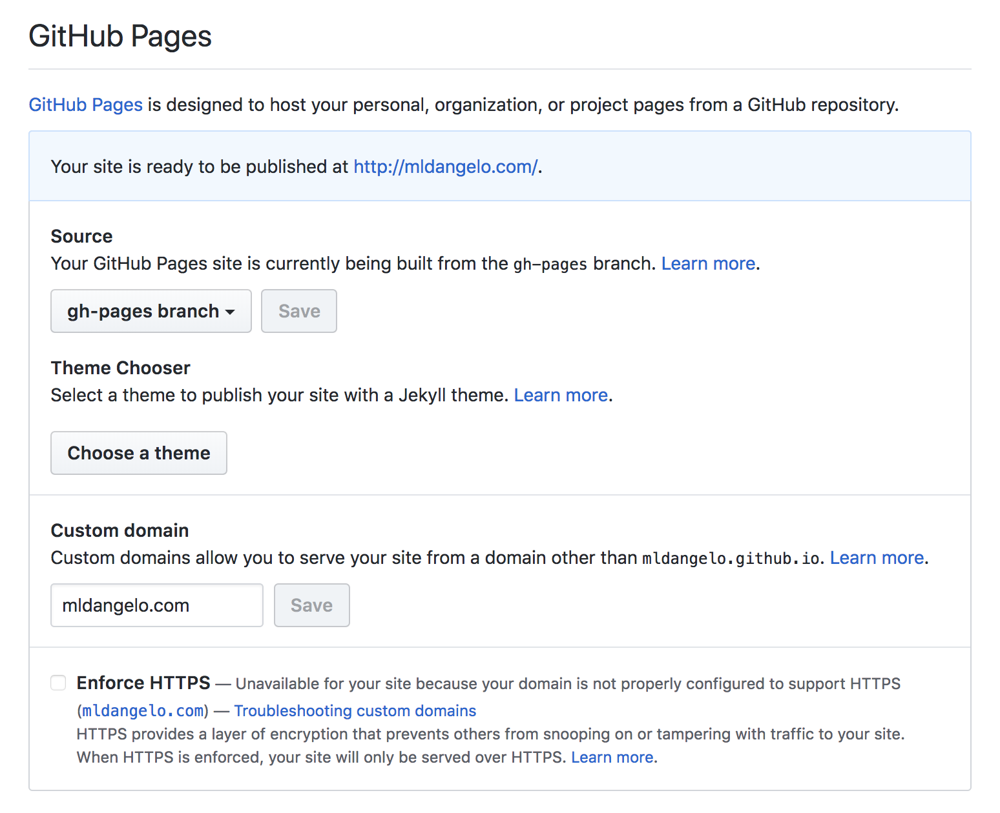

# [karantech.com](http://karantech.com) and simplified [karantech.github.io/personal-site](https://karantech.github.io/personal-site/)

My personal website. Easily modifiable, and built using modern javascript with Node.js, React, Express, React-Router, Hot Module Reloading, Webpack and many other technologies.

The master branch of this repository contains a simplified version of my website intended for serverless hosting on github pages. To view the source for the version hosted at [karantech.com](http://karantech.com), checkout the [server](https://github.com/0x-genesys/personal-site/tree/server) branch.

## A note on adapting this repository to your own personal website

Many people have contacted me about adapting this website. I have tried to make things as simple as possible. There are still bugs. I am sorry. If you find a bug, please email me (karan.ahuja2014@gmail.com) or submit an issue or a pull request.

## Dependencies

Tested with:

* node >= v8, v9, v10, v11
* Recommend [nvm](https://github.com/creationix/nvm#installation) for managing node versions

## Set up

You may wish to fork this repository or remove my remote origin and add your own. Go [here](https://help.github.com/articles/changing-a-remote-s-url/) for more information on changing remotes.  

1. To download the repository and install dependencies, run the following commands:

    ```bash
    git clone git://github.com/0x-genesys/personal-site.git
    cd personal-site
    npm install
    ```

    If you do not have `yarn` installed, you may run `npm install` instead.

2. Next, you should create a `.env` file. To do this, run:

    ```bash
    cp sample.env .env
    ```

    and set values as appropriate. Most people will not need to make changes.

3. Run the following command to build the react application and serve it with hot module reloading:

    ```bash
    npm run dev
    ```

    Navigate to `<ip>:<port>` default: [http://localhost:7999](http://localhost:7999) to view my website.

    This completes set up instructions. Please continue reading to learn how to modify this site to make it your own.

## Checklist

1. Start by changing text in the sidebar. This file is located at `app/components/Template/Nav.js`.
2. Add an image of yourself in `public/images/me_icon.jpg`. If you decide to change the filename, be sure to go back to the sidebar and change the image path there as well.
3. Modify the text in `app/views/Index.js`
4. Modify the files in `app/data/resume/` next. When you're finished, go back and modify all of the other files in the `app/data/` directory.
5. You've finished modifying >95% of the pages. Search through the rest of the files for references to `Karan` or `Ahuja` and change values to your name.
6. Change the description in `server/views/index.tpl.html`. You may also wish to add a new favicon or remove it. [This](https://realfavicongenerator.net/) website may be helpful.
7. Decide how and where you are going to host this project. I recommend purchasing your own domain name from [Google Domains](https://domains.google). If you would like to host on github pages, run `npm run deploy`. This will generate a new branch called `gh-pages`. Then go to `https://github.com/[your github username]/personal-site/settings` and configure accordingly:

    

8. Configure your domains DNS record. See [here]( https://help.github.com/articles/using-a-custom-domain-with-github-pages/) for more information.
9. If using a custom url, modify the `CNAME` file to point to your URL. Modify the npm deploy script by appending `&& cp CNAME dist/` to the end of the `predeploy` line in the scripts section of package.json.
If you plan to deploy to a /[path]
(e.g. [https://0x-genesys.github.io/personal-site/](https://0x-genesys.github.io/personal-site/)), you should modify `BASE_PATH` in your `.env` and `sample.env` files and restart the express server. Note that you will now have to navigate to `localhost:[port]/[BASE_PATH]` when developing.

## Deploying to Github Pages

1. Change `NODE_ENV` to `production` in `.env`
2. Run `npm run deploy`

That's it.

Please feel free to reach out to me by filing an issue or at karan.ahuja2014@gmail.com for help configuring your project.

## Contributors

* [@mldangelo](https://github.com/mldangelo)
* [@typpo](https://github.com/typpo)

## Acknowledgements

* Special thanks to [@typpo](https://github.com/typpo) for tirelessly answering all of my node.js and react questions.
* Template based on [Future Imperfect](https://html5up.net/future-imperfect) by [@ajlkn](https://github.com/ajlkn) for [HTML5 UP](html5up.net).

## License

[MIT](https://github.com/0x-genesys/personal-site/blob/master/LICENSE)
